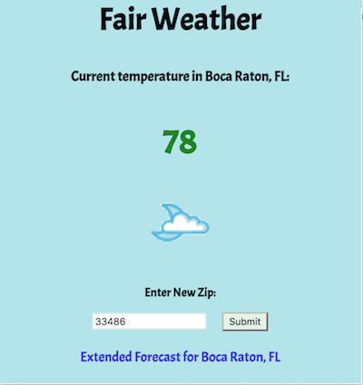

## Fair Weather

This is a simple Google Chrome extension that offers forecast data. It allows the user to enter in any valid five-digit US zip code and then retrieve the current temperature and an icon representing the current weather state (rainy, sunny, etc.). The app saves the user's last entry to `localStorage`, so it will appear (and update) the next time the user opens to app. There is also a link at the bottom for the extended forecast for that city.

All weather data courtesy of the [Weather Underground API](https://www.wunderground.com/weather/api/d/docs?d=index).

*Sources that proved useful:*

* [Google's Chrome Extensions Tutorial](https://developer.chrome.com/extensions/overview)
* [Thoughbot post on how to build an intermediate-level Chrome extension](https://robots.thoughtbot.com/how-to-make-a-chrome-extension)

*Photo credits:*

* [Dog](http://janfennellthedoglistener.com/static/cms/ConfusedDog.png)
* [Sun icon](https://icomoon.io/app/#/select)
